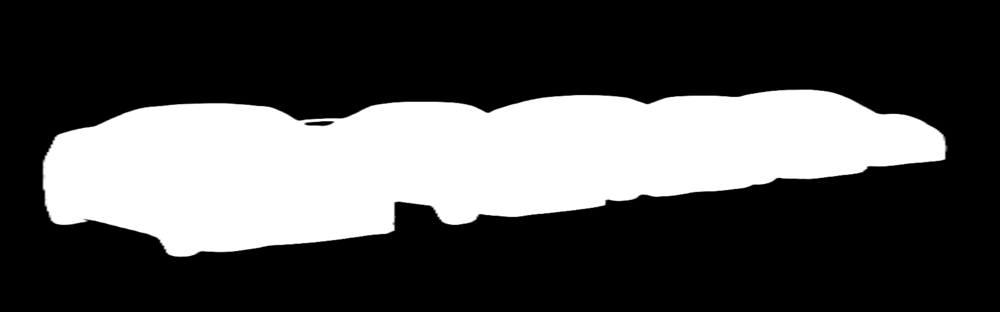
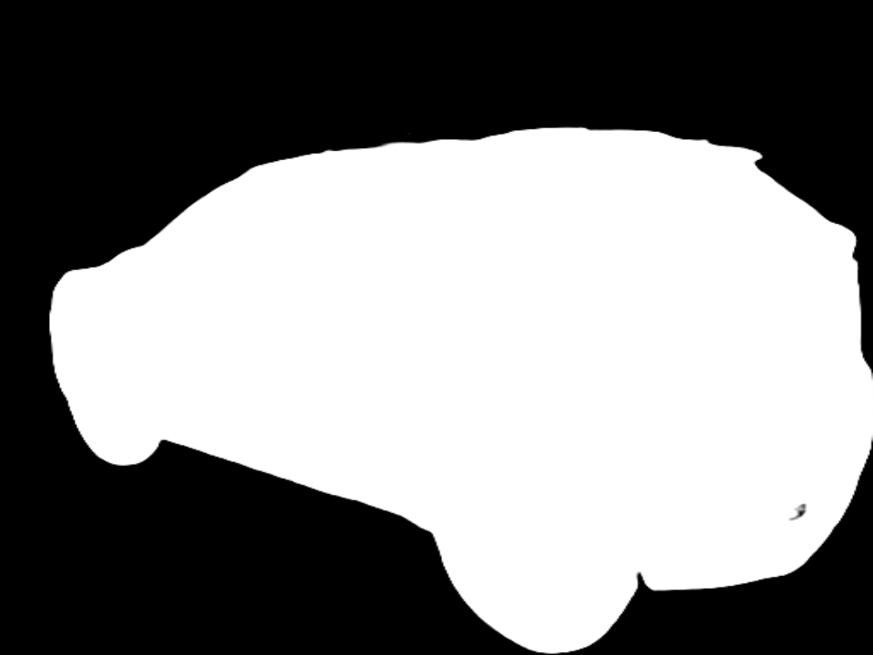
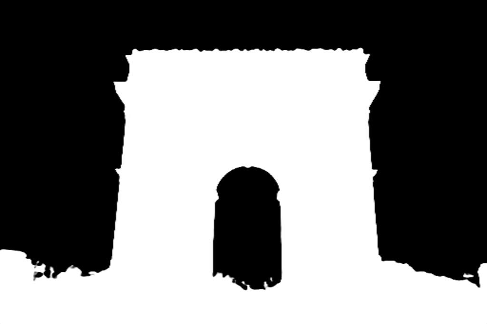
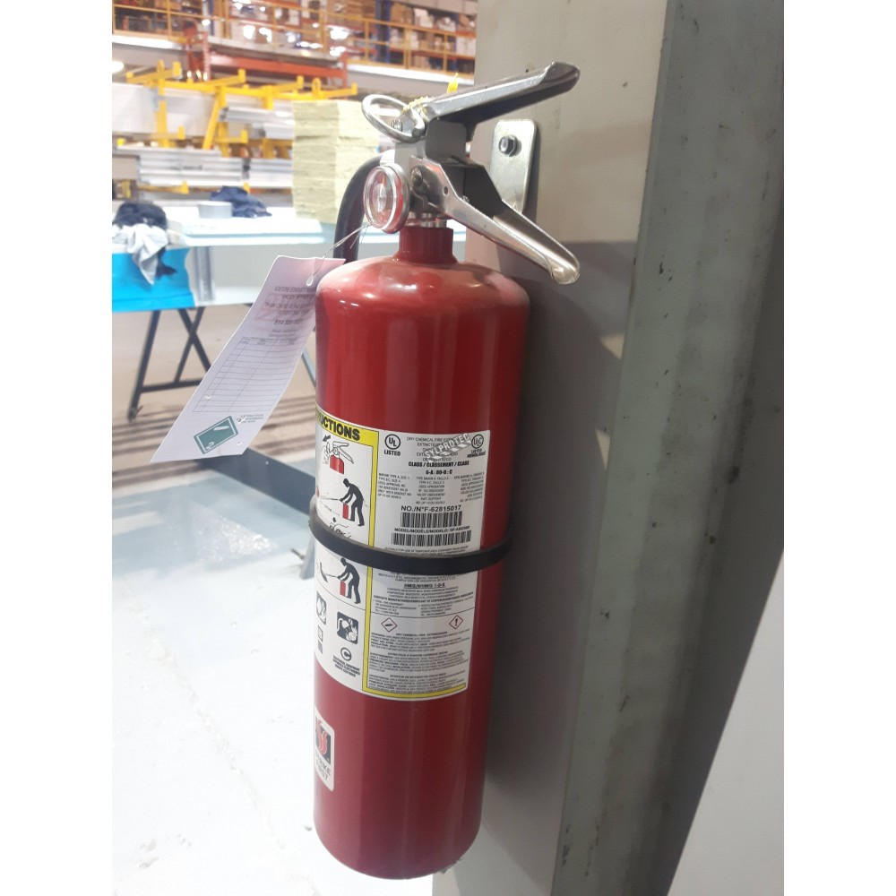
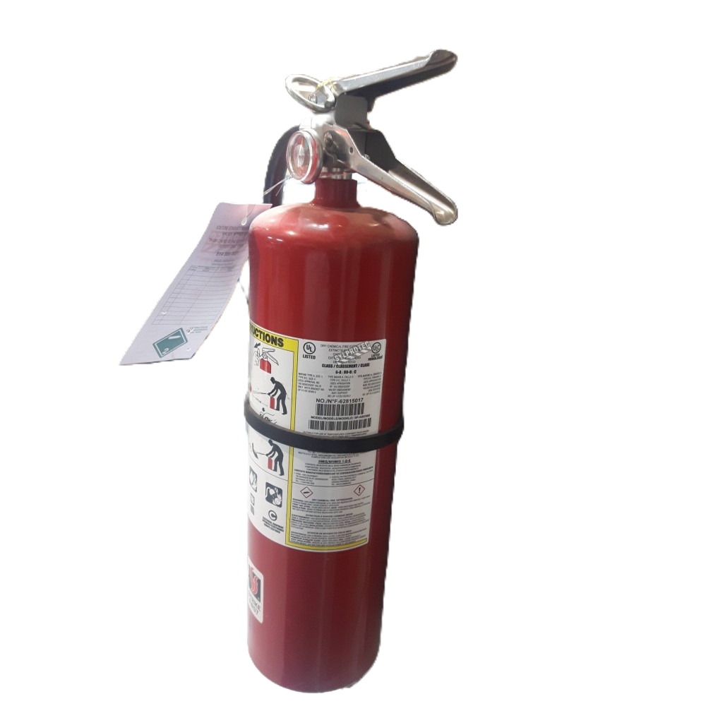
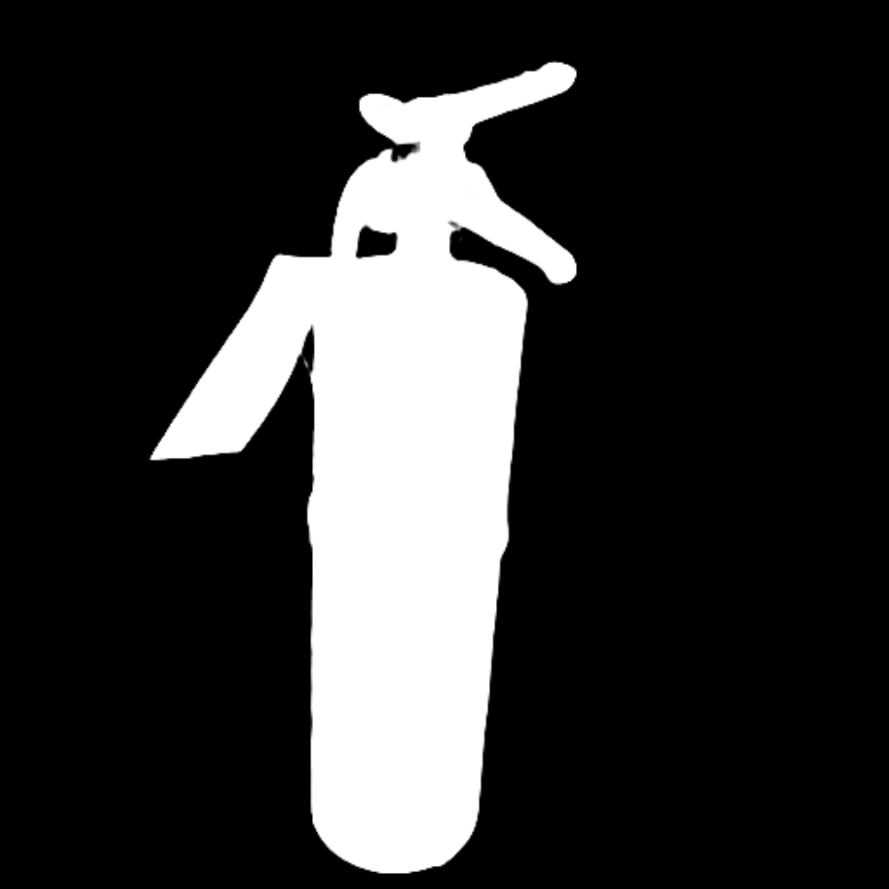

# removing_background_azure_computer_vision_4

**The Image Analysis** service can divide images into multiple segments or regions to help the user identify different objects or parts of the image. **Background removal** creates an alpha matte that separates the foreground object from the background in an image.

This feature provides two possible outputs based on the customer's needs:

- The **foreground object** of the image without the background. This edited image shows the foreground object and makes the background transparent, allowing the foreground to be placed on a new background.
- An **alpha matte** that shows the opacity of the detected foreground object. This matte can be used to separate the foreground object from the background for further processing.

This service is currently in preview, and the API may change in the future.

## Python demo notebook
<a href="https://github.com/retkowsky/removing_background_azure_computer_vision_4/blob/main/Background%20removal%20with%20Azure%20Computer%20Vision%204.ipynb">Python demo notebook</a>

## Some examples

13-Mar-2023 Serge Retkowsky | serge.retkowsky@microsoft.com | https://www.linkedin.com/in/serger/
